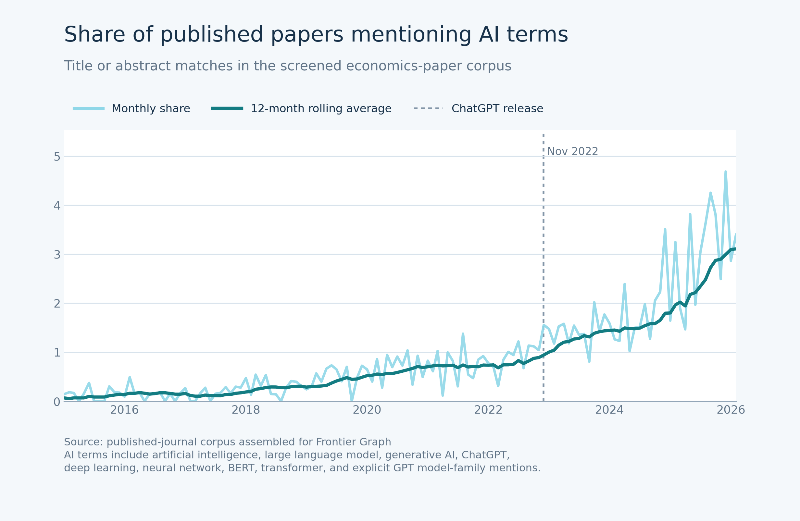
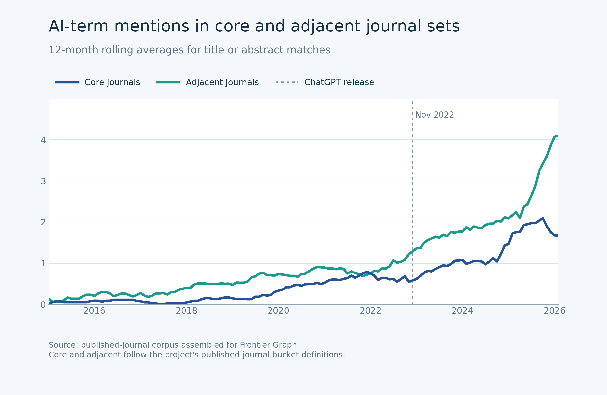
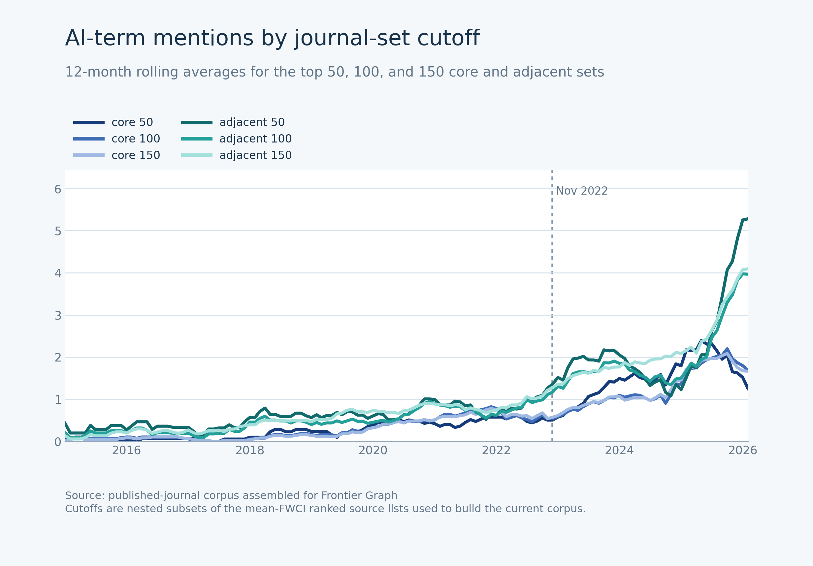
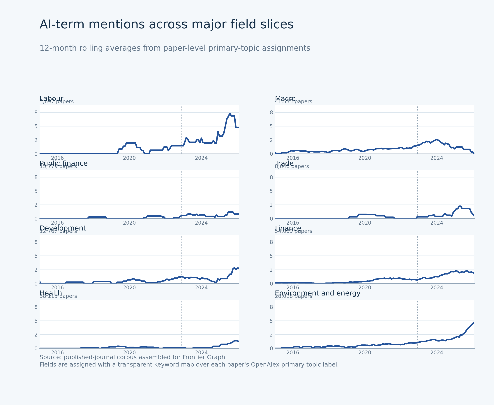

# AI Mentions in Published Economics Papers

This folder is a small, self-contained replication bundle for one descriptive exercise:

- track the share of published papers in the screened corpus that mention AI-related terms in their title or abstract
- compare the full corpus and the `core` vs `adjacent` split
- break the same series down by journal cutoffs and by broad economics fields

The bundle is meant to be easy to open from GitHub. The figures are embedded below, and the plotting script plus the monthly data series are included in the same folder.

## How to view this locally

GitHub will render this file automatically. Locally, the easiest options are:

- open this file in VS Code and use Markdown Preview with `Shift-Command-V`
- open the PNGs directly from `extras/ai_mentions/figures/`
- or open the raw README in a browser/editor that supports Markdown image preview

If you just want the main chart immediately, open:

- `extras/ai_mentions/figures/frontiergraph_ai_mentions_share.png`

## Main figure



## Core vs adjacent



## Top 50 / 100 / 150 journal cutoffs



## Major-field breakdown



## What this uses

- Screened paper universe: the published-paper extraction corpus in `data/production/frontiergraph_extraction_v2/.../fwci_core150_adj150_extractions.sqlite`
- Publication dates: the enriched OpenAlex database in `data/processed/openalex/published_enriched/openalex_published_enriched.sqlite`
- Journal cutoffs: the ranked source lists in `data/production/frontiergraph_extraction_v2/fwci_core150_adj150/source_lists/`
- Term search: title plus abstract

## Method

At a high level, the exercise does four things:

1. Start from the screened published-paper corpus rather than the wider upstream OpenAlex universe.
2. For each paper, combine title and abstract text and search for a fixed list of AI-related terms.
3. Aggregate those matches to the month level and compute:
   - monthly share = matched papers / all dated papers that month
   - 12-month rolling average of that monthly share
4. Trim the final partial month from the plotted view when the month is obviously incomplete relative to recent months.

The main corpus run in this snapshot contains `242,482` screened papers with usable publication dates.

### Corpus splits used here

- `all`: full screened published-paper corpus
- `core`: core economics journals in the screened corpus
- `adjacent`: adjacent journals in the screened corpus
- `core top 50 / 100 / 150`: nested subsets of the ranked core source list used to build the current corpus
- `adjacent top 50 / 100 / 150`: nested subsets of the ranked adjacent source list used to build the current corpus

### Field splits used here

The field figure uses a simple, transparent mapping from each paper's OpenAlex `primary_topic_display_name` into broad buckets:

- Labour
- Macro
- Public finance
- Trade
- Development
- Finance
- Health
- Environment and energy

This is a keyword map over the topic label, not a separate supervised classifier. The exact patterns are written directly in `plot_frontiergraph_ai_mentions.py`.

Current term list:

- `artificial intelligence`
- `large language model`
- `generative ai`
- `generative artificial intelligence`
- `chatgpt`
- `deep learning`
- `neural network`
- `bert`
- `transformer`
- explicit `GPT` model-family mentions such as `GPT-3`, `GPT-4`, `GPT-4o`, `GPT-5`

Deliberate choice:

- the script does **not** use bare `GPT` on its own, because that is too noisy in economics text

## What the figures are showing

### Main figure

- light blue line: monthly share of papers mentioning one of the AI terms
- dark blue line: 12-month rolling average
- dotted vertical line: ChatGPT release

### Core vs adjacent

- both lines are 12-month rolling averages
- one line corresponds to `core` and one to `adjacent`

### Top 50 / 100 / 150 journal cutoffs

- all six lines are 12-month rolling averages
- blue shades are the `core` cutoffs
- teal shades are the `adjacent` cutoffs
- the `50`, `100`, and `150` lines are nested within each bucket

### Major-field breakdown

- each panel shows the 12-month rolling average for one field slice
- field slices are assigned from paper-level primary-topic labels
- the small count under each field name is the number of screened papers in that slice

## Outputs in this folder

- `plot_frontiergraph_ai_mentions.py`: plotting/reproduction script snapshot
- `figures/`: PNG and SVG outputs
- `data/frontiergraph_ai_mentions_monthly.csv`: full corpus monthly series
- `data/frontiergraph_ai_mentions_monthly_core.csv`: core-only monthly series
- `data/frontiergraph_ai_mentions_monthly_adjacent.csv`: adjacent-only monthly series
- `data/frontiergraph_ai_mentions_monthly_cutoffs.csv`: monthly series for the top 50 / 100 / 150 cutoff splits
- `data/frontiergraph_ai_mentions_monthly_fields.csv`: monthly series for the major-field splits
- `data/frontiergraph_ai_mentions_metadata.json`: source paths, counts, and term metadata

## How to rerun

From the repo root:

```bash
MPLCONFIGDIR=/tmp/mplconfig python3 scripts/plot_frontiergraph_ai_mentions.py
```

That regenerates the canonical outputs under:

- `outputs/analysis/`
- `outputs/figures/`

This `extras/ai_mentions/` folder is a portable snapshot for sharing on GitHub, so if you rerun the script and want this bundle refreshed, copy the updated outputs back into this folder.

## Notes

- The full screened corpus in this run contains `242,482` papers with usable publication dates.
- The AI-term search matches `1,072` of those papers.
- The field breakdown is intentionally simple and transparent. It is meant as a readable slice, not a full paper-level field classifier.
- The plotted view trims the final partial month when the count is clearly incomplete relative to recent months.
