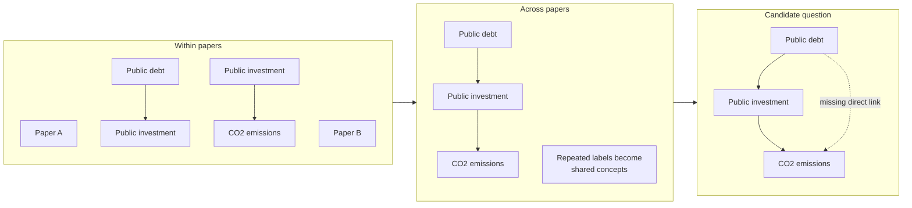
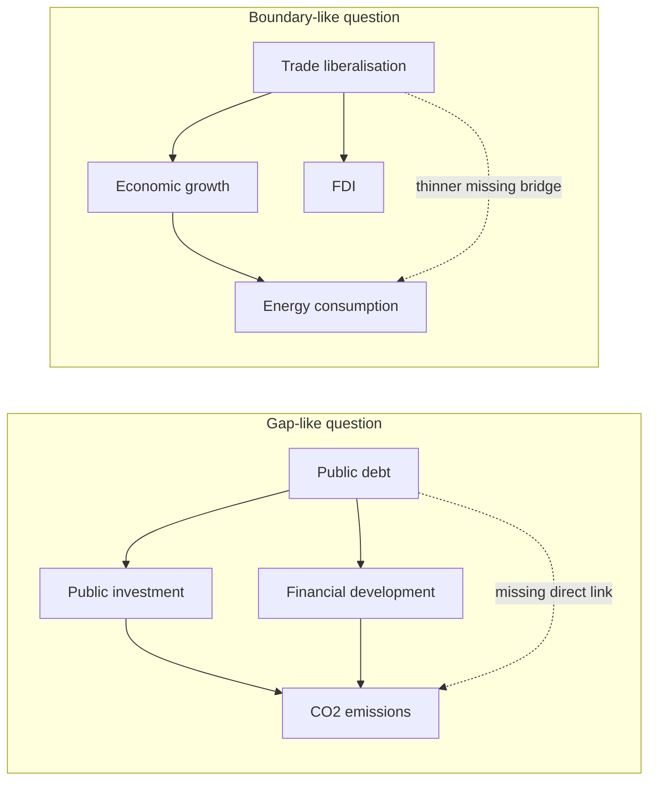
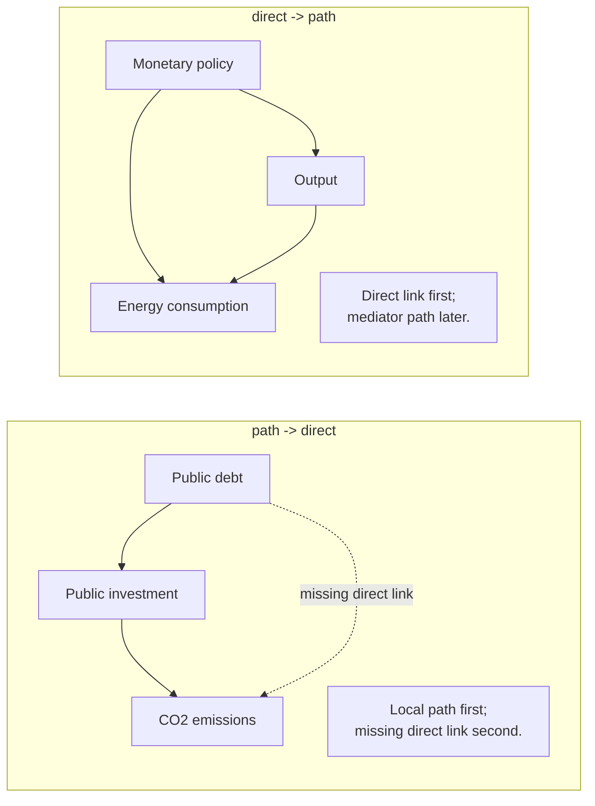
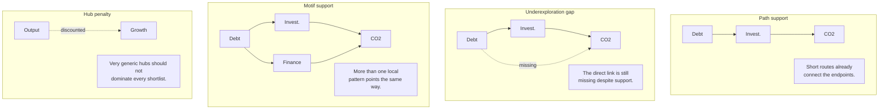
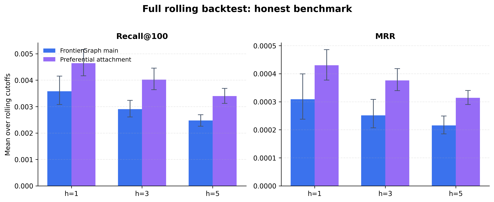

# What Should Economics Ask Next?

Prashant Garg

15 March 2026

Work-in-Progress Draft (Preliminary and Incomplete).

Do not cite or circulate.

## Abstract

This paper studies research allocation in economics: how to identify questions that are neglected enough to be open, supported enough to be credible, and concrete enough to become a paper. I build a claim graph from a field-weighted citation impact selected published-journal corpus of 242,595 papers spanning 1976-2026. Nodes are extracted concepts, while links summarize claim-like relations already observed in papers. Missing links become candidate next questions. I rank them with a graph-based score that combines path support, underexploration gaps, motif support, and hub penalties, and I evaluate the ranking prospectively using leakage-controlled vintage backtests over 3-, 5-, 10-, and 15-year horizons. The main benchmark is preferential attachment, a cumulative-advantage rule that favors links between already central concepts. At the strict shortlist benchmark, preferential attachment remains difficult to beat. But that tight-rank headline is too narrow to settle the research-allocation question. Once the reading budget widens, the graph-based rule becomes more competitive; weighting future links by later reuse changes the scale of the benchmark but does not overturn it; and the favorable cases are concentrated in adjacent journals, design-based causal slices, and path-rich parts of the literature. A complementary path-evolution audit suggests that the literature often adds mediating structure around existing direct claims more often than it closes a missing direct link already implied by local paths. Alongside the empirical exercise, the paper introduces [frontiergraph.com](https://frontiergraph.com/) as a public interface for browsing candidate questions and inspecting the graph structure behind them.

**Keywords.** research allocation; economics of science; knowledge graphs; preferential attachment; AI-assisted discovery

## 1. Introduction

Choosing what to work on is one of the least formalized decisions in economics. We have disciplined frameworks for identification, estimation, and inference, but much less for the upstream choice of which question deserves scarce attention in the first place. Bloom et al. (2020) argue that ideas are getting harder to find, while Jones (2009) emphasizes the growing knowledge burden faced by new researchers. Those arguments point in the same direction: the frontier becomes harder to navigate even as the stock of published work keeps growing.

That problem becomes sharper, not weaker, when AI lowers the cost of adjacent research tasks. Systems such as Project APE are explicitly testing whether parts of the paper-production cycle can be automated. Tools such as Refine, venue-level reviewer guidance such as the ICLR 2026 Reviewer Guide, and agentic review prototypes such as Stanford Agentic Reviewer all point toward the same institutional change: drafting, review assistance, and iterative revision are becoming cheaper. If production and review become less scarce, the bottleneck shifts toward a different margin. The question is no longer only how to write or review a paper more cheaply. It is how to decide which question deserves attention next.

This paper studies that margin. The core idea is to treat candidate next questions as missing links in a graph of claim-like relations already present in the literature. Suppose the literature already contains links such as public debt -> public investment and public investment -> CO2 emissions, but the direct relation public debt -> CO2 emissions has not yet appeared. That missing direct link is a concrete candidate question. More generally, the object is not generic semantic similarity and not a free-form brainstorming system. It is a structured search for missing relations that look plausible given nearby literature and underworked given the current graph. In this paper, `should` is therefore used in a narrower operational sense than a welfare theorem: a question deserves attention next when it is neglected enough to remain open, supported enough to be credible, concrete enough to become a paper, and better read at realistic fixed attention budgets than at a winner-take-all top rank. This paper studies that margin and offers a tool to inspect it in practice at [frontiergraph.com](https://frontiergraph.com/).

That graphical view is useful because it preserves more of the local logic of scientific development than keyword overlap or raw citation counts alone. It lets us see whether a putative question is supported by short paths, repeated motifs, and nearby mediating concepts, and whether the direct link itself still looks thin relative to its neighborhood. The framework is intentionally modest. It is a discovery aid, not proof of importance; a prospective ranking exercise, not a welfare theorem; and a graph of extracted claim relations, not a full adjudication of causal truth from complete papers.

The empirical design starts from a field-weighted citation impact selected corpus of top core and adjacent journals. The selected sample contains 242,595 papers from 1976-2026, of which 230,929 contain at least one extracted edge and 230,479 survive into the normalized graph used in evaluation. I build that graph from the paper-level extraction framework in Garg and Fetzer (2025), then distinguish between directed causal links and undirected contextual support inside a single graph object. Missing directed links are ranked by a graph-based score built from path support, underexploration gaps, motif support, and hub penalties. I then freeze the graph at year `t-1`, rank candidates, and test whether those links first appear over 3-, 5-, 10-, and 15-year horizons.

The headline result is mixed and therefore informative. Preferential attachment remains a serious benchmark and still wins in the pooled rolling benchmark at very tight shortlists. In concrete terms, a 100-paper shortlist built from preferential attachment retrieves roughly 2.6, 3.3, 7.0, and 10.0 more realized directed links than the graph score at `h=3,5,10,15`. But that is not the end of the story. Once the reading budget is allowed to expand beyond the strict top 100, the graph-based score becomes more competitive. The newer heterogeneity results also suggest that pooled averages hide meaningful variation across journals, methods, and parts of the literature. A separate path-evolution exercise points to a second pattern: research often builds mediating structure around existing direct claims more often than it closes a direct link already implied by local paths.

## 2. Related Literature and Positioning

This paper sits at the intersection of four literatures.

First, it belongs to the economics of ideas and discovery. Bloom et al. (2020) document rising research effort alongside falling research productivity across several domains, while Jones (2009) studies how accumulating knowledge changes the organization of innovative activity. The present paper shifts attention to a narrower but operationally central problem: given a large existing literature, how should one screen candidate next questions?

Second, the paper draws on the science-of-science literature that uses large-scale scientific data to study novelty, impact, and frontier formation. Fortunato et al. (2018) provide a broad synthesis. Wang and Barabasi (2021) show how scientific frontiers can be studied quantitatively, while Uzzi et al. (2013) show how novelty often combines conventional structure with a limited number of atypical combinations. That literature is highly relevant in spirit, but my object differs. I do not measure novelty from citations or reference-pair combinations. I define candidate questions as missing links in a claim graph and evaluate them prospectively.

Third, the benchmark logic comes from network growth and cumulative advantage. Price (1976) and Barabasi and Albert (1999) show why already connected nodes tend to attract more links. For this project, that is the main null. If the future of the literature is mostly a popularity process, then a rich-get-richer rule should perform well when the target is future edge appearance.

Fourth, the paper enters a fast-moving literature and policy discussion around AI-assisted scientific work. Some recent systems aim at hypothesis generation, literature synthesis, or general scientific assistance. Others are already productized around manuscript feedback, reviewer assistance, or automated evaluation workflows. My contribution is not a new general-purpose AI assistant and not a new claim-extraction model. The paper uses AI-extracted paper-level structure as an enabling layer, then asks an economics question: can we convert that structure into an inspectable, prospectively testable research-allocation object?

## 3. Corpus, Paper-Local Extraction, and Node Normalization

The paper starts from a published-journal corpus rather than a broad scrape of all economics-adjacent writing. The selected journal corpus contains 242,595 papers drawn from the top 150 core economics journals and the top 150 adjacent journals under the field-weighted citation impact selection rule. The sample spans 1976-2026. Of those papers, 230,929 contain at least one extracted edge, yielding 1,443,407 raw extracted edges. After normalization and graph construction, the evaluation graph retains 230,479 papers, 6,752 concept codes, and 1,271,014 normalized links.

### 3.1 Corpus definition

The paper uses the published-journal corpus because the goal is to study realized scientific structure in an economics-facing literature, not to optimize coverage of working papers, drafts, or preprints. This choice is conservative. It sacrifices some freshness in exchange for clearer journal control, more stable metadata, and a graph that is easier to interpret as realized economics research rather than a noisy mix of partially filtered text. OpenAlex provides the work-level metadata, journal metadata, and journal assignments used to define that bibliographic layer.



**Notes.** Figure 1 shows the core measurement pipeline as a worked example. The unit of observation at extraction is the individual paper title and abstract. Each paper first produces a paper-local graph, repeated concept labels are then matched into shared concept identities across papers, and the resulting concept-level structure can surface a missing direct relation as a candidate question.

### 3.2 Paper-local research graphs

The extraction layer builds on Garg and Fetzer (2025). Each title and abstract is converted into a paper-local graph in which nodes correspond to extracted concepts and edges summarize the relations the paper itself states, studies, or reports. The present paper inherits that idea but extends it in three ways that matter downstream. First, the schema is broader than explicit causal claims, because the evaluation also needs undirected contextual support. Second, the schema separates the paper's causal presentation from the evidence method used to support a claim. Third, the local graph stores contextual qualifiers in dedicated fields rather than forcing them into the node label. Exact prompts, the full schema, and the design logic are reported in Appendix A. **The code and prompt files used in this paper will be released at `github.com/[repository-to-be-inserted-at-release]`.**

### 3.3 Concept identity and node normalization

The normalization problem is central in this paper because candidate generation, path counts, gap measures, and missingness all depend on node identity. Paper-local concept strings vary in wording, scope, and granularity. The paper therefore builds a native concept ontology and combines deterministic lexical matching with an embedding-based retrieval step for harder cases, while preserving mapping provenance and quality bands. In practice, the embedding layer is used only after exact and signature-based passes, so it helps rank plausible matches rather than silently forcing all strings together. Appendix B gives the full algorithmic detail.

| Symbol | Definition |
|---|---|
| `G_(t-1)=(V,E_(t-1))` | Claim graph assembled from papers observed through year `t-1`. |
| `u,v,w` | Normalized concept nodes in the ontology-backed graph. |
| `u -> v` | Directed causal link or directed causal candidate. |
| `{u,v}` | Undirected noncausal pair. |
| `h` | Evaluation horizon in years. |
| `K` | Shortlist size in the fixed-budget retrieval problem. |

## 4. Candidate Questions and Evaluation Design

The framework is simple. At year `t-1`, let `G_(t-1)=(V,E_(t-1))` denote the claim graph assembled from papers observed through that date. A candidate question is represented as a missing link in that graph. For a directed causal candidate, `u -> v` is eligible when that ordered directed link has not yet appeared in the historical graph. For an undirected noncausal candidate, `{u,v}` is eligible when the pair has not yet appeared as undirected support. The headline object in this paper is the directed causal candidate.

### 4.1 Missing links as candidate questions

One way to read the novelty and frontier literatures is that many advances come from combinations or connections that were not yet explicit in the recorded structure of a field. The representation used here takes that intuition in a narrow form. The point is not that every paper can be reduced to one edge. The point is that many research moves can be approximated as the appearance of a relation that was locally plausible before it was explicit. That lets us define a narrow, prospectively testable object.

### 4.2 Gap and boundary questions

Gap questions already have rich nearby support but remain directly underworked. Boundary questions connect areas that still have little direct traffic between them.



**Notes.** Figure 2 contrasts two candidate objects. The left panel is a local gap: nearby support is already dense, but the direct relation remains missing. The right panel is a thinner boundary question: the two end concepts are connected only by sparse bridges. The node labels are lightly cleaned versions of surfaced economics-facing examples.



**Notes.** Figure 3 fixes the core candidate object. A local path such as `u -> w -> v` can nominate a missing direct link `u -> v` as a candidate next paper. But later work can also add mediator paths around an existing direct relation rather than closing a missing direct link. The main backtest focuses on the left-hand object; the later path-evolution section returns to the right-hand pattern.

### 4.3 How the score reads the graph

The ranking rule combines four ingredients: path support, underexploration gap, motif support, and hub penalty. Path support asks whether the two endpoint concepts are already connected by short routes through nearby mediators. The gap term asks whether those routes exist even though the direct relation itself is still absent or thin. Motif support asks whether the same endpoint pair keeps reappearing inside nearby structural patterns rather than in only one fragile corner of the graph. The hub penalty moves in the opposite direction: it reduces scores that are high only because both endpoints are extremely generic, heavily connected concepts.



**Notes.** Figure 4 breaks the score into four local graph features. Path support asks whether short routes already connect the endpoints. The underexploration gap asks whether the direct relation is still missing despite that support. Motif support asks whether more than one nearby pattern points toward the same endpoint pair. The hub penalty discounts pairs that would rank highly only because both concepts are very generic and heavily connected.

In the implementation used for this paper,

`s(u,v)=alpha * P_tilde(u,v) + beta * G(u,v) + gamma * M_tilde(u,v) - delta * H_tilde(u,v)`.

### 4.4 Prospective evaluation

The prospective design freezes the graph at year `t-1`, ranks candidates using only information available at that date, and then checks whether those links first appear over the evaluation horizon. In other words, the score at `t-1` is not allowed to borrow future edges, future degrees, or later realized papers. A cutoff is eligible for horizon `h` only if `t+h <= 2026`.

**Preferential attachment as benchmark.** Preferential attachment scores a candidate ordered pair by source out-degree times target in-degree: `PA(u,v)=d_out(u) * d_in(v)`.

**Fixed-budget retrieval.** The evaluation problem is a scarce-attention problem. That is why the paper emphasizes Recall@100, other fixed-budget shortlist measures, and frontier-style comparisons over larger `K`.

**Horizon choice.** The main horizons are 3, 5, 10, and 15 years because they correspond to distinct practical windows. Twenty years remains an appendix extension.

## 5. What the Benchmark Shows

### 5.1 Popularity at the strict shortlist

Preferential attachment remains stronger than the graph-based score at the strict top-100 margin across all four main horizons. The easiest way to read the magnitude is in future links captured inside a 100-paper shortlist: preferential attachment places about `8.3`, `12.0`, `23.3`, and `36.3` future directed links inside the top 100 at `h=3,5,10,15`, while the graph-based score places about `5.7`, `8.7`, `16.3`, and `26.3`. So the popularity benchmark buys roughly `2.6`, `3.3`, `7.0`, and `10.0` extra realized directed links inside the same 100-paper reading list. Put differently, preferential attachment retrieves roughly 40 percent more realized directed links than the graph score, depending on the horizon. The normalized Recall@100 and MRR statistics tell the same story.



**Notes.** The left panel reports Recall@100 and the right panel reports mean reciprocal rank. Each bar is the mean across eligible rolling cutoffs for a given horizon, with bootstrap confidence intervals. Higher values mean better prospective ranking performance. For readers who prefer a more concrete scale, the corresponding mean hits inside the top-100 shortlist are about `5.7`, `8.7`, `16.3`, and `26.3` for the graph score and `8.3`, `12.0`, `23.3`, and `36.3` for preferential attachment across `h=3,5,10,15`.

The small values are real, but they are not trivial. On average, the future contains about 2,955 realized directed links at `h=3`, 4,994 at `h=5`, 13,221 at `h=10`, and 29,809 at `h=15`. So the top-100 shortlist is being asked to recover a small fraction of a very large future stock.

### 5.2 The attention-allocation frontier

The first way to move from prediction toward allocation is to relax the top-100 bottleneck. Economists rarely consume one candidate suggestion and stop. They browse shortlists. The attention-allocation outputs therefore ask what happens when the screening budget expands from `K=50` to `K=1000`. I summarize that margin using `future links per 100 suggestions`, which is just the shortlist precision rescaled into a more readable unit.

The result is again mixed but informative. At `h=3`, preferential attachment places about `11.0` future links per 100 suggestions at `K=100`, compared with `5.75` for the graph score. By `K=1000`, the two rules are essentially tied in practical terms: preferential attachment yields about `4.25` future links per 100 while the graph score yields about `4.70`. The same pattern appears at `h=5`: the gap is `14.75` versus `8.25` at `K=100`, but `6.83` versus `7.10` by `K=1000`. At `h=10`, the tight-budget gap remains larger, yet even there the frontier narrows substantially, from `27.5` versus `17.75` at `K=100` to `13.6` versus `13.5` by `K=1000`.


**Notes.** Each panel reports mean future links per 100 surfaced suggestions as the shortlist expands from `K=50` to `K=1000`. The quantity is a rescaled precision measure computed over common rolling cutoff-year cells. Preferential attachment remains stronger at very small `K`, but the gap shrinks sharply as the reading budget widens.

That makes the current paper's answer to the title more precise. If `what should economics ask next?` is interpreted as `what is the single most likely next direct link?`, preferential attachment wins. If it is interpreted as `which questions should a researcher read, scope, or test next under a realistic shortlist budget?`, the graph-based object becomes more relevant. It remains weaker at the very top rank, but it moves materially closer once the screening problem looks more like actual research browsing.

### 5.3 What changes when future links are value-weighted

Future appearance is not the only margin that matters. A later realized link can also be weighted by downstream reuse, so that some realized links count more than others. The impact-weighted rerun therefore asks whether the graph score looks relatively better once the future is weighted by later reuse rather than treated as binary appearance alone.

The answer is again disciplined rather than triumphant. Weighted MRR still favors preferential attachment at each of the main horizons: about `0.001523` versus `0.001383` at `h=3`, `0.001154` versus `0.000943` at `h=5`, and `0.000809` versus `0.000568` at `h=10`. So the strict-headline result is not only about low-value fills. Central concepts still capture more of the heavily reused future links. But the broader weighted frontier is less one-sided than the weighted MRR line alone suggests. At `K=1000`, weighted recall is nearly tied at `h=3` and `h=10`: preferential attachment reaches about `0.01762` and `0.01495`, while the graph score reaches about `0.01729` and `0.01488`. The gap is still larger at `h=5`, but even there it is far smaller than the tight-rank headline would suggest.


**Notes.** The left panel reports weighted MRR by horizon, where future realized links are weighted by later reuse. The right panels report weighted recall frontiers over shortlist size `K`. Preferential attachment still dominates the tighter top ranks, but the weighted frontier narrows materially at broad lists.

That result matters for how the title should be read. It shows that the paper is not merely reclassifying trivial future links as success. Weighting by downstream reuse leaves the top-rank popularity story intact. The more favorable reading for the graph score enters instead through broader attention frontiers and through the kinds of literatures in which local structure does more screening work.

This is also where the paper's credibility story enters. The graph is not built from raw co-occurrence. It already carries stability, causal-presentation, evidence-type, and edge-role metadata from the paper-local extraction layer. Appendix E shows that directed causal rows have mean stability around `0.93`, compared with about `0.87` for undirected contextual rows, and that over 90 percent of directed causal rows fall into the high-stability band. So the method-family heterogeneity results below are not just subfield color. They are part of the paper's broader claim that some local graph neighborhoods are more credible terrain for screening than others, even though the current main score does not yet fully weight those signals.

### 5.4 Where structure helps more

The pooled top-100 comparison hides meaningful variation. The most useful way to read the atlas is not as a search for one subgroup in which the graph score cleanly "wins." It is a map of where cumulative advantage is more dominant and where local graph structure adds more screening value. Once the frontier is evaluated over broader fixed-`K` and percentile-`K` shortlists, the graph score becomes substantially more competitive than the strict top-100 headline suggests.


**Notes.** The pooled frontier figure reports the graph score's relative recall advantage over preferential attachment. Positive values favor the graph score. The lighter horizon lines correspond to shorter horizons and the darker lines to longer horizons.

Journal tier matters. Adjacent journals are more favorable terrain for the structural score than the core. Method family matters as well. Design-based causal slices are much more favorable than panel- or time-series-heavy slices.


**Notes.** This figure reports the main method-family heterogeneity estimates from the atlas. The practical reading is that design-based causal slices are materially more favorable to the graph score than panel- or time-series-heavy slices.

Funding adds nuance rather than a single clean pattern. In the coarse funded-versus-unfunded split, the funded literature is less favorable to the graph score than the unfunded literature. The appendix therefore treats funding as suggestive rather than central, and the funding-by-journal interaction view is useful mainly because it shows that the funded pattern is not uniform.


**Notes.** The main topic heatmap prioritizes the most populous economics-facing topic groups rather than all broad adjacent categories. Cell color reports the pooled percentile-frontier advantage of the graph score over preferential attachment, while the annotations report the top-100 hit delta in basis points.

The robust main-text message is therefore restrained but substantive. Broader frontier shortlists soften the pooled headline. Adjacent journals look better than the core. Design-based slices look better than panel or time series. Several concrete economics topics look better than the pooled average. Funding seems to matter, but mostly as a secondary institutional layer on top of the more basic popularity-versus-structure comparison. If the title is read as a question about where a structural screen is most useful, this subsection gives the clearest answer: not everywhere equally, but especially in adjacent, design-based, and several concrete economics-facing topic clusters.

### 5.5 Path evolution beyond direct-link closure

#### 5.3.1 Aggregate transition patterns

The direct-link framing is not the only way research can evolve. I distinguish two simple transition types on length-2 structure. `path_to_direct` means a supporting path exists first and the missing direct edge later appears. `direct_to_path` means the direct edge exists first and a supporting mediator path appears only later.


**Notes.** The figure compares `path_to_direct` and `direct_to_path` transitions. The key interpretation is that mechanism-deepening around existing direct claims is often more common than direct-link closure.

At `h=10`, for example, the direct-to-path share rises from roughly `0.049` in the 1980s to `0.089` in the 1990s, `0.178` in the 2000s, and `0.355` in the 2010s. The corresponding path-to-direct shares are much smaller: about `0.023`, `0.014`, `0.015`, and `0.020`.

#### 5.3.2 Where path closure is more common

The journal split is especially revealing. At `h=3,5,10,15`, the share of realized path-related transitions that take the path-to-direct form is about `0.571`, `0.579`, `0.529`, and `0.471` in adjacent journals, but only about `0.442`, `0.443`, `0.400`, and `0.360` in the core.


**Notes.** The figure reports the share of realized path-related transitions that take the path-to-direct form by journal tier and horizon. Adjacent journals are consistently more path-to-direct heavy than core journals.

The broad subfield split points in the same direction. Economics and Econometrics is relatively balanced at short horizons, while Finance is more direct-to-path heavy throughout.


**Notes.** This figure reports the share of realized path-related transitions that take the path-to-direct form by broad subfield and horizon. Economics and Econometrics is more balanced than Finance at short horizons, but both become more direct-to-path heavy at longer horizons.

#### 5.3.3 Current path-rich examples

The recommendation layer already hints at what path-rich questions look like. Investment -> carbon emissions is supported by 38 observed paths through concepts such as economic growth, technological innovation, and economic development. Public debt -> CO2 emissions has 23 supporting paths through growth, financial development, and renewable energy consumption. Monetary policy -> energy consumption has 23 supporting paths through income, output, and income inequality. These examples are not historical validation evidence, but they do show why the path-based object is concrete enough to inspect in the public interface rather than treat as an abstract graph statistic.

| Candidate question | Supporting paths | Example mediators |
|---|---:|---|
| Investment -> carbon emissions | 38 | economic growth; technological innovation; economic development |
| Public debt -> CO2 emissions | 23 | economic growth; financial development; renewable energy consumption |
| Monetary policy -> energy consumption | 23 | income; output; income inequality |
| Trade liberalisation -> energy consumption | 5 | economic growth; foreign direct investment; trade liberalization |
| Urbanization -> output growth | 17 | CO2 emissions; energy consumption; energy use |

Taken together, Sections 5.1 to 5.5 imply a cumulative reading of the evidence. The strict top-100 benchmark is harsh and popularity-dominated. Broader attention frontiers soften that headline. Value-weighting changes the scale of the comparison without reversing it. Heterogeneity shows where structural screening is actually more useful. The path audit then explains why even that richer reading still does not exhaust the graph's value: a good share of scientific development takes the form of mechanism-deepening around existing direct claims, not only direct-link closure itself. In that sense, the most useful questions to ask next are often better understood as path-rich research programs than as single isolated missing edges.

## 6. FrontierGraph as Research Tool

[FrontierGraph](https://frontiergraph.com/) is the public interface built on top of this empirical framework. The site is not the evidence for the paper's main claims. Its role is different: it makes the ranked objects inspectable. A user can browse candidate questions, inspect supporting paths and mediators, move from a surfaced pair to nearby literature, and decide whether the object is a gap question, a boundary question, or a path-rich mechanism question that still needs substantive vetting.

## 7. Discussion and Conclusion

Several limits matter for interpretation. A future realized link is not the same thing as truth, importance, or policy value. The benchmark is about future appearance in the literature, not about a complete normative theory of which questions economists should pursue. If cumulative advantage dominates the future, preferential attachment can outperform even when the graph score is surfacing more genuinely underexplored questions.

Direction in the graph records ordered claim relations rather than final causal adjudication. The main score still treats the existence of an edge more seriously than the strength or credibility of the underlying evidence. The published-journal corpus is a further deliberate restriction rather than a universal map of all economics research.

These limits do not make the exercise empty. They define its scope. The paper's answer to its own title is narrower than a welfare theorem but still substantive: economics should not decide what to ask next only through cumulative advantage. The most useful surfaced questions are neglected enough to remain open, supported enough to be credible, concrete enough to become papers, and best read at realistic attention frontiers rather than at winner-take-all top ranks. Empirically, that means the strict top-100 shortlist still favors preferential attachment, but broader attention frontiers, value-weighted outcomes, heterogeneity, and path development all make more room for structural screening than the pooled headline alone suggests. Practically, the paper pairs that screening object with a public interface that makes surfaced questions inspectable rather than opaque. A next iteration should add stronger credibility weighting and richer path-based objects, and could also compare explanation or reranking layers across LLMs as a bounded appendix-style extension without changing the current paper's observational core.

## Appendix A. Paper-local graph extraction

This appendix documents the paper-local extraction layer used in the paper's evaluation. Garg and Fetzer (2025) show that economics papers can be converted into paper-level claim graphs by prompting a language model to recover nodes, directional relations, and claim metadata from title-and-abstract text. The present paper inherits that paper-local view of extraction but extends it in service of a different downstream object.

### Prompts

**System prompt**

```text
You extract a paper-local research graph from a paper title and abstract.

Return only structured output that matches the supplied JSON schema.

Task:
- Read the paper title and abstract.
- Build a paper-local graph with `nodes` and `edges`.
- Reuse the same node when the same concept genuinely recurs within the same paper.
- Do not use outside knowledge.
- Do not infer relationships that are not supported by the title or abstract.

Purpose:
- The output will later be turned into a larger deterministic research graph.
- Downstream systems depend on consistent paper-local node reuse.
- If the abstract contains a chain like `A -> B`, `B -> C`, and `X -> B`, the shared concept `B` should be represented by the same paper-local node if it is genuinely the same concept.
- However, do not merge distinct concepts just because they seem related.

Critical rules:
- Do not create transitive closure.
- If the abstract states `A -> B` and `B -> C`, do not create `A -> C` unless the paper explicitly states `A -> C`.
- Do not create both `A -> B` and `B -> A` for one undirected claim.
- If the title or abstract says two variables are associated or correlated without directional language, encode one edge with `directionality = undirected`.
- For undirected edges, use the first-mentioned concept as `source_node_id` and the second-mentioned concept as `target_node_id` only as a storage convention.

How to represent nodes:
- Use concise noun phrases grounded in the paper text.
- Keep node labels concept-level when possible.
- Do not bake country or year into the node label unless it is essential to the concept itself.
- Put local scope information into `study_context` or `condition_or_scope_text`.
- Use `surface_forms` for distinct mentions that refer to the same paper-local concept.
- Use `study_context` only for context explicitly stated in the title or abstract.
- If no context is stated, use:
  - `unit_of_analysis: []`
  - `start_year: []`
  - `end_year: []`
  - `countries: []`
  - `context_note: "NA"`

How to represent edges:
- Extract only relations that the title or abstract states, studies, or reports.
- Keep background or prior-literature claims only if they are explicitly stated in the title or abstract, and mark them with `edge_role = background`.
- Use `claim_text` as a short normalized relation string.
- Use `evidence_text` as a short supporting excerpt or close paraphrase from the title/abstract only.

Directionality:
- Use `directionality = directed` when the paper frames one concept as affecting, predicting, changing, increasing, decreasing, explaining, or determining another.
- Use `directionality = undirected` when the paper frames the relation as association, correlation, co-movement, similarity, or linkage without directional commitment.
- Prediction is directional, even if it is not causal.

Causal presentation:
- `explicit_causal`: the paper explicitly uses causal language such as affects, causes, leads to, increases, reduces, impact of, effect of.
- `implicit_causal`: the paper strongly frames the relation as an effect or treatment relation without fully explicit causal wording.
- `noncausal`: the paper frames the relation as association, correlation, prediction, linkage, or descriptive relation.
- `unclear`: the wording is too ambiguous to classify confidently.
- This field is about how the paper presents the relation, not whether the method truly justifies causality.

Relationship type:
- `effect`: one concept is presented as affecting another.
- `association`: correlation, co-movement, linkage, or association.
- `prediction`: one concept predicts or forecasts another.
- `difference`: one concept differs across groups, places, times, or conditions.
- `other`: only if none of the above fit.

Edge role:
- `main_effect`: central edge or main result in the abstract.
- `mechanism`: pathway or channel relation.
- `heterogeneity`: subgroup or conditional variation in a relation.
- `descriptive_pattern`: stylized fact or descriptive empirical pattern.
- `background`: motivating or prior-literature relation stated in the abstract.
- `robustness`: supporting or validating relation rather than the main contribution.
- `other`: only if needed.

Claim status:
- `effect_present`: the abstract reports that the relation is present.
- `no_effect`: the abstract reports no effect or no relation.
- `mixed_or_ambiguous`: the abstract reports mixed, inconsistent, or ambiguous results.
- `conditional_effect`: the relation holds only for some subgroup, time period, or condition.
- `question_only`: the abstract raises or studies the relation but does not report a result.
- `other`: only if needed.

Explicitness:
- `result_only`: the relation is presented as a result.
- `question_only`: the relation is posed as a question or objective only.
- `question_and_result`: the abstract both frames the question and reports a result on the same relation.
- `background_claim`: the relation appears as background motivation or prior literature.
- `implied`: the relation is clearly implied by the abstract wording but not directly phrased as a standalone claim.

Condition or scope:
- Use `condition_or_scope_text` for subgroup, timing, geographic, or sample qualifiers on the edge.
- Use `NA` if not needed.

Sign:
- `increase`, `decrease`, `no_effect`, `ambiguous`, `NA`

Statistical significance:
- `significant`, `not_significant`, `mixed_or_ambiguous`, `not_reported`, `NA`

Evidence method:
- Choose the best supported option from the schema.
- `experiment`, `DiD`, `IV`, `RDD`, `event_study`, `panel_FE_or_TWFE`, `time_series_econometrics`, `structural_model`, `simulation`, `theory_or_model`, `qualitative_or_case_study`, `descriptive_observational`, `prediction_or_forecasting`, `other`, `do_not_know`

Nature of evidence:
- Choose the broad evidence type used for that edge.

Uses data:
- `true` if the edge is supported by data use described in the title/abstract.

Sources of exogenous variation:
- Record only if explicitly stated in the title or abstract.
- Otherwise use `NA`.

Tentativeness:
- `certain`, `tentative`, `mixed_or_qualified`, `unclear`

What not to do:
- Do not label edges as collider, confounder, mediator, instrument, or any other downstream graph-structural role.
- Do not globally canonicalize concepts across papers.
- Do not create edges from general world knowledge.
- Do not invent countries, years, samples, or methods.

If the title/abstract contains no extractable graph:
- return `nodes: []` and `edges: []`
```

**User prompt template**

```text
Extract a paper-local research graph from the following title and abstract.

Use only the information in the title and abstract.
Return only the structured output that matches the supplied JSON schema.

Title:
{{paper_title}}

Abstract:
{{paper_abstract}}
```

### Schema

#### Node fields

| Field | Allowed values / type | Meaning | Why it exists downstream |
|---|---|---|---|
| `node_id` | string | Paper-local identifier such as `n1` | Stable local concept key |
| `label` | short string | Concise concept label | Base string passed to normalization |
| `surface_forms` | array of strings | Distinct surface mentions | Preserves within-paper synonymy |
| `study_context.unit_of_analysis` | array | Explicit unit of analysis | Keeps sample off the node label |
| `study_context.start_year` | array of integers | Explicit start years | Preserves local scope |
| `study_context.end_year` | array of integers | Explicit end years | Preserves local scope |
| `study_context.countries` | array of strings | Explicit countries | Preserves setting without splitting concept identity |
| `study_context.context_note` | string | Residual local scope text | Keeps nuance for audit/display |

#### Edge fields

| Field | Allowed values / type | Meaning | Why it exists downstream |
|---|---|---|---|
| `edge_id` | string | Paper-local edge identifier | Stable local relation key |
| `source_node_id`, `target_node_id` | strings | Local node references | Connect edge to local nodes |
| `directionality` | directed / undirected | Whether the relation is directional | Determines storage as ordered or undirected |
| `relationship_type` | effect / association / prediction / difference / other | Coarse semantic type | Later filtering and audit |
| `causal_presentation` | explicit_causal / implicit_causal / noncausal / unclear | How the paper speaks about the relation | Separates language from design |
| `edge_role` | main_effect / mechanism / heterogeneity / descriptive_pattern / background / robustness / other | Role in the paper | Separates central claims from channels and background |
| `claim_status` | effect_present / no_effect / mixed_or_ambiguous / conditional_effect / question_only / other | What result the paper reports | Distinguishes results from question-only edges |
| `explicitness` | result_only / question_only / question_and_result / background_claim / implied | How explicitly the edge is framed | Distinguishes stated from implied claims |
| `condition_or_scope_text` | string | Edge-level qualifier | Keeps scope on the relation |
| `claim_text` | string | Short normalized relation text | Audit-friendly summary |
| `evidence_text` | string | Short supporting excerpt/paraphrase | Makes extraction inspectable |
| `sign` | increase / decrease / no_effect / ambiguous / NA | Reported sign | Later descriptive splits |
| `effect_size` | string | Reported magnitude | Reserved for future extensions |
| `statistical_significance` | enum | Reported significance status | Keeps evidence strength distinct |
| `evidence_method` | enumerated method family | Main method family | Determines directed vs contextual role downstream |
| `evidence_method_other_description` | string | Text when method is `other` | Preserves method specificity |
| `nature_of_evidence` | enum | Broad evidence type | Helps separate theory and empirical slices |
| `uses_data` | boolean | Whether the edge uses data | Simple theory/empirical flag |
| `sources_of_exogenous_variation` | string | Explicit exogenous source if named | Future credibility-weighting hook |
| `tentativeness` | certain / tentative / mixed_or_qualified / unclear | Strength of the language | Separates cautious from assertive claims |

### Design choices

**Paper-local node reuse.** Downstream graph construction depends on whether a path inside one paper reuses a local concept consistently.

**No transitive closure.** Missing direct links are the object of interest. If extraction created transitive closure, the benchmark would erase many of the candidates it later wants to rank.

**Directed versus undirected storage.** Undirected relations are stored once by convention rather than duplicated as two directed edges.

**Keeping scope off the node label.** Country, year, subgroup, and sample qualifiers are stored in dedicated context fields whenever possible.

**Separating `causal_presentation` from `evidence_method`.** A paper can talk causally without using a strong design, and vice versa.

**Separating `claim_status`, `explicitness`, `tentativeness`, and `edge_role`.** These fields overlap in plain language but do different jobs downstream.

## Appendix B. Node normalization and ontology construction

Node normalization is a major measurement problem in its own right. Paper-local concept strings vary in wording, scope, and granularity. Candidate generation, path counts, and missingness all depend on node identity.

### Why a native ontology is needed here

Garg and Fetzer (2025) use the extracted paper-level objects for a different downstream task. The present paper asks a more node-sensitive question. Here the downstream object is a reusable concept graph in which a candidate next paper is a missing link between specific concepts. In that setting, broad field labels are too coarse.

### Implemented pipeline

| Stage | What it does | Why it is needed |
|---|---|---|
| Head pool | Selects high-support labels by coverage and support thresholds | Defines a stable candidate set |
| Accepted heads | Clusters compatible head labels into native concept IDs | Creates the ontology inventory |
| Hard mapping | Uses exact, lexical-signature, and reviewed embedding rules | Resolves easy cases conservatively |
| Soft mapping | Uses shortlist/global embedding matching and lexical shortlists | Maps the middle tail |
| Pending labels | Stores unresolved labels and why they failed to map | Makes the tail auditable |
| Force-mapped tail recovery | Assigns unresolved labels to existing head concepts with stored score, margin, and quality band | Expands benchmark coverage while preserving provenance |

The fuller force-mapped corpus is now the canonical benchmark because the alternative was to let mapping quality mechanically determine which literatures count as candidate-generating.

## Appendix C. Benchmark construction and significance

| Quantity | Count |
|---|---:|
| Source-selected papers | 242,595 |
| Papers with extracted edges | 230,929 |
| Raw extracted edges | 1,443,407 |
| Normalized benchmark papers | 230,479 |
| Unique concepts in benchmark graph | 6,752 |
| Directed causal rows | 89,737 |
| Undirected contextual rows | 1,181,277 |
| Total normalized links | 1,271,014 |

| Metric | h=3 | h=5 | h=10 | h=15 |
|---|---:|---:|---:|---:|
| Recall@100, graph-based main model | 0.003239 | 0.002518 | 0.001956 | 0.001494 |
| Recall@100, preferential attachment | 0.003826 | 0.003105 | 0.002784 | 0.002138 |
| MRR, graph-based main model | 0.000811 | 0.000524 | 0.000334 | 0.000227 |
| MRR, preferential attachment | 0.000901 | 0.000637 | 0.000420 | 0.000281 |

| Quantity | h=3 | h=5 | h=10 | h=15 |
|---|---:|---:|---:|---:|
| Delta Recall@100 | -0.000587 | -0.000588 | -0.000828 | -0.000644 |
| p-value for Delta Recall@100 | 0.740 | 0.064 | 0.000 | 0.000 |
| Delta MRR | -0.000090 | -0.000113 | -0.000086 | -0.000054 |
| p-value for Delta MRR | 0.000 | 0.000 | 0.000 | 0.000 |

## Appendix D. Heterogeneity atlas extensions


**Notes.** Rows correspond to cutoff-period bins and columns to horizons. Cell color reports the pooled percentile-frontier advantage of the graph score over preferential attachment.


**Notes.** This interaction view combines funding status and journal tier. It is useful but secondary because funding coverage is uneven and institution-level interpretation mixes composition with behavior.


**Notes.** The main topic heatmap prioritizes the most populous economics-facing topic groups rather than all broad adjacent categories.


**Notes.** Only stable, high-support funders are shown. The current stable set keeps ESRC, NSFC China, DFG, and NSF.

## Appendix E. Credibility audit summaries

The main score does not yet fully weight evidence quality, but the benchmark object is not blind to it either. The extraction layer already records stability, causal presentation, evidence type, and related claim metadata. The tables below should therefore be read as a quality audit of the empirical object rather than as a replacement ranking model.

### Edge kind

| Edge kind | Rows | Papers | Mean stability | Explicit-causal share |
|---|---:|---:|---:|---:|
| Directed causal | 89,737 | 23,213 | 0.930 | 69.0% |
| Undirected contextual | 1,181,277 | 221,192 | 0.868 | 45.3% |

### Directed causal evidence types

| Evidence type | Rows | Mean stability | Explicit-causal share |
|---|---:|---:|---:|
| Panel FE / TWFE | 44,106 | 0.938 | 68.8% |
| Difference-in-differences | 16,658 | 0.933 | 75.1% |
| Experiment | 15,616 | 0.900 | 56.7% |
| Event study | 6,247 | 0.940 | 73.5% |
| Instrumental variables | 5,601 | 0.933 | 78.3% |
| Regression discontinuity | 1,509 | 0.922 | 80.3% |

### Stability bands

| Edge kind | High stability | Mid stability | Low stability |
|---|---:|---:|---:|
| Directed causal | 91.8% | 5.6% | 2.6% |
| Undirected contextual | 85.4% | 5.1% | 9.5% |

## Appendix F. Path-evolution extensions


**Notes.** Economics and Econometrics is more balanced than Finance at short horizons, but both become more direct-to-path heavy at longer horizons.

| Candidate question | Supporting paths | Example mediators |
|---|---:|---|
| Investment -> carbon emissions | 38 | economic growth; technological innovation; economic development |
| Public debt -> CO2 emissions | 23 | economic growth; financial development; renewable energy consumption |
| Monetary policy -> energy consumption | 23 | income; output; income inequality |
| Trade liberalisation -> energy consumption | 5 | economic growth; foreign direct investment; trade liberalization |
| Urbanization -> output growth | 17 | CO2 emissions; energy consumption; energy use |

## Appendix G. Tool and interpretation notes

The website layer is designed to expose the ranked objects rather than to replace the benchmark. In particular, the public interface helps with three tasks that the evaluation tables alone cannot solve: inspecting why a candidate surfaced, seeing which mediators or neighboring concepts support it, and distinguishing a local gap question from a thinner boundary question.

Two final diagnostic facts are useful when reading the paper. First, grant metadata are present but incomplete, with coverage much stronger in recent years than in older decades. Second, the graph already contains method and stability metadata that can support richer credibility-weighted benchmarks later.

## References

- Barabasi, Albert-Laszlo, and Reka Albert. 1999. "Emergence of Scaling in Random Networks." *Science* 286(5439): 509-512.
- Bloom, Nicholas, Charles I. Jones, John Van Reenen, and Michael Webb. 2020. "Are Ideas Getting Harder to Find?" *American Economic Review* 110(4): 1104-1144.
- Carnehl, Christoph, Marco Ottaviani, and Justus Preusser. 2024. *Designing Scientific Grants*. NBER Working Paper 32668.
- Fortunato, Santo, et al. 2018. "Science of Science." *Science* 359(6379): eaao0185.
- Garg, Prashant, and Thiemo Fetzer. 2025. "Causal Claims in Economics." arXiv:2501.06873.
- Jones, Benjamin F. 2009. "The Burden of Knowledge and the `Death of the Renaissance Man': Is Innovation Getting Harder?" *Review of Economic Studies* 76(1): 283-317.
- Price, Derek J. de Solla. 1976. "A General Theory of Bibliometric and Other Cumulative Advantage Processes." *Journal of the American Society for Information Science* 27(5): 292-306.
- Uzzi, Brian, Satyam Mukherjee, Michael Stringer, and Ben Jones. 2013. "Atypical Combinations and Scientific Impact." *Science* 342(6157): 468-472.
- Wang, Dashun, and Albert-Laszlo Barabasi. 2021. *The Science of Science*. Cambridge University Press.
