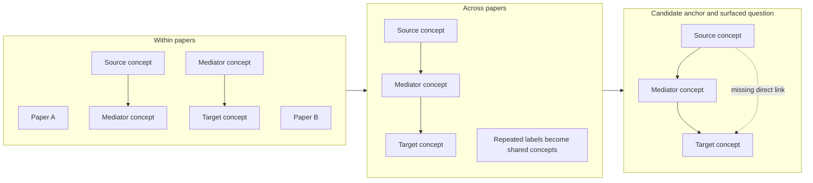
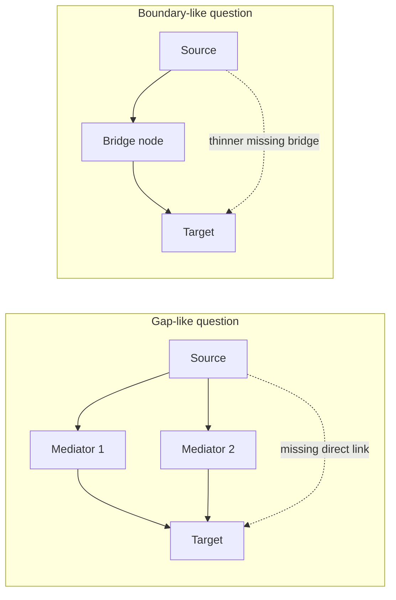
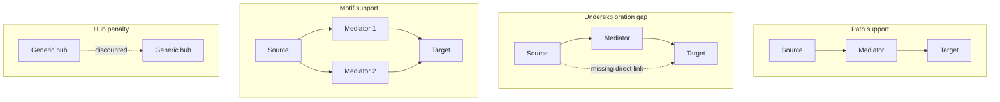

## Abstract

As AI makes drafting, coding, and reviewing cheaper, the scarce input in research may shift toward question choice. This paper studies that problem in economics using a directed literature graph built from 242,595 papers in core economics and adjacent journals published from 1976 to early 2026. The benchmarkable object is simple: at year `t-1`, I ask whether a missing directed link in the graph later appears in the literature. That missing link is the measurement anchor. The human-facing object is richer: researchers do not want to inspect a bare missing edge, so I surface path-rich or mechanism-rich questions built around the same endpoints.

The paper compares a graph-based screening score with a simple preferential-attachment-style benchmark that favors already well-connected topics. The benchmark is hard to beat at very tight shortlists. In a top-100 list, preferential attachment retrieves about `2.6`, `3.3`, `7.0`, and `10.0` more future directed links than the graph score at `h=3,5,10,15`. But that is not the whole decision problem. Once the shortlist widens and the task becomes “which questions should a researcher inspect next under limited attention?”, the gap narrows sharply. The graph-based score also performs relatively better in adjacent journals, design-based empirical work, and literatures with richer nearby path structure.

The contribution is practical rather than universal. The paper proposes a screening tool for candidate questions, not a full theory of scientific discovery. It keeps the benchmark simple and prospectively testable, then shows how to translate promising missing-link anchors into readable path or mechanism questions. Routed overlays such as context transfer and evidence-type expansion appear only as later extensions. Internal ontology work and family-aware comparisons help interpretation, but they are not the paper’s main empirical object.

**Keywords.** research allocation; economics of science; knowledge graphs; preferential attachment; AI-assisted discovery

## 1. Introduction

Choosing what to work on is one of the least formalized decisions in economics. We have disciplined frameworks for identification, estimation, and inference, but much less for the upstream decision of which question deserves scarce attention in the first place. Bloom et al. (2020) argue that ideas are getting harder to find, while Jones (2009) emphasizes the burden created by an expanding stock of knowledge. Those arguments point to the same practical problem: as literatures grow, finding a question that is both open and worth pursuing becomes harder.

That problem matters even more if AI lowers the cost of adjacent tasks such as literature review, drafting, coding, and revision. If downstream paper-production tasks become cheaper, the bottleneck shifts upstream toward question choice. The relevant question is then narrower than “what should economics study?” in the abstract. It is: can we screen candidate next questions in a disciplined way, using the structure of past research?

This paper studies that narrower object. I build a directed literature graph from economics-facing papers and use missing directed links as benchmarkable retrieval anchors. Suppose the literature already contains `price changes -> energy demand` and `energy demand -> CO2 emissions`, but not the direct relation `price changes -> CO2 emissions`. The missing direct link is the historical anchor that later either appears or does not appear. A researcher, however, would rarely want to inspect only that raw anchor. The more natural question is richer: what nearby pathways could connect price changes to CO2 emissions, or which mechanisms most plausibly connect them? The paper therefore separates the measurement anchor from the surfaced research object.

That separation is the organizing idea of the paper. The missing directed link is useful because it is clean, dated, and prospectively testable. It lets me compare a graph-based score with a simple preferential-attachment-style benchmark on the same object: later link appearance. But the human-facing question is not generic link prediction. It is a screening problem under limited attention. A candidate question is useful if it is still open, nearby enough to be credible, concrete enough to become a paper, and readable enough to survive a shortlist.

The benchmark comparison is intentionally simple. At each year cutoff, I freeze the graph, rank missing directed links, and ask whether those links later appear in the literature over `3`, `5`, `10`, and `15` year horizons. The main comparator is preferential attachment: a popularity rule that favors topics that are already well connected. That is the right null here. If future links mainly go where attention is already concentrated, a rich-get-richer benchmark should be hard to beat.

The headline result is disciplined rather than triumphant. Preferential attachment performs better at the very top of the ranking. In a top-100 shortlist, it retrieves about `8.3`, `12.0`, `23.3`, and `36.3` future directed links at `h=3,5,10,15`, while the graph score retrieves about `5.7`, `8.7`, `16.3`, and `26.3`. But once the shortlist widens, the comparison becomes less one-sided. The graph score becomes materially more competitive at larger `K`, especially in adjacent journals, design-based empirical work, and areas of the literature with richer local path structure. A separate path-development exercise also shows that scientific development often deepens mediator structure around existing direct claims rather than simply closing the missing direct link first.

The paper makes three contributions. First, it proposes a prospectively testable screening benchmark for candidate questions in economics by using missing directed links as retrieval anchors in a claim graph. Second, it shows why the object a researcher should inspect is usually richer than the anchor itself: path-rich and mechanism-rich questions are often more informative than bare missing edges. Third, it shows where local graph structure is more useful for screening, and where cumulative advantage remains dominant.

The rest of the paper proceeds as follows. Section 2 positions the paper in the literatures on scientific discovery, network growth, and research allocation. Section 3 describes the corpus, extraction layer, and concept normalization. Section 4 defines the benchmark object and evaluation design. Section 5 presents the benchmark results, attention-allocation frontier, heterogeneity, path development, and current surfaced examples. Section 6 concludes. The appendices document extraction, normalization, audit tables, and extensions.

## 2. Related Literature and Positioning

This paper sits at the intersection of four literatures.

First, it belongs to the economics of ideas and scientific discovery. Bloom et al. (2020) document rising research effort alongside declining research productivity, while Jones (2009) studies how an expanding stock of knowledge changes how innovation is organized. Those papers motivate the allocation problem. My contribution is narrower and more operational: given a large existing literature, can we screen candidate next questions in a way that is prospectively testable and practically inspectable?

Second, the paper relates to the science-of-science literature on novelty, frontier formation, and the organization of discovery. Fortunato et al. (2018) provide a broad overview. Wang and Barabasi (2021) show how scientific frontiers can be studied quantitatively, and Uzzi et al. (2013) show that influential work often combines conventional structure with a limited number of atypical combinations. The present paper shares that interest in structure, but it uses a different object. I do not measure novelty from citation combinations or reference distances. I use missing directed links in a claim graph as retrieval anchors and evaluate them prospectively.

Third, the benchmark logic comes from network growth and cumulative advantage. Price (1976) and Barabasi and Albert (1999) explain why already connected nodes tend to attract more links. In this setting that is the natural null. If future research mostly accumulates around already central topics, then preferential attachment should be strong when the target is future link appearance.

Fourth, the paper joins a growing conversation about AI-assisted scientific work. Recent systems help with literature synthesis, drafting, search, and reviewer support. My contribution is not a new general-purpose assistant and not a new extraction model. The paper uses an AI-assisted extraction layer as infrastructure, then asks a narrower economics question: can that structure support a useful screening rule for candidate next questions?

That positioning matters for interpretation. The paper is not trying to explain all scientific progress or replace expert field knowledge. It evaluates a screening rule under realistic attention constraints. The right standard is therefore modest: does the method surface candidate questions that are worth reading, scoping, or testing, and can it do that in a way that is benchmarkable against a simple and credible null?

## 3. Corpus, Paper-Local Extraction, and Node Normalization

The paper starts from a published-journal corpus rather than a broad scrape of all economics-adjacent writing. That choice is conservative. It sacrifices some freshness in exchange for clearer journal control, more stable metadata, and a graph that is easier to interpret as realized economics research rather than a mix of partially filtered drafts and preprints.

The selected corpus contains 242,595 papers drawn from the top 150 core economics journals and the top 150 adjacent journals under a field-weighted citation impact selection rule. The sample spans 1976 to early 2026. Of those papers, 230,929 contain at least one extracted edge, yielding 1,443,407 raw extracted edges. After normalization and graph construction, the current benchmark snapshot retains 230,479 papers and 1,271,014 normalized links. The ontology inventory itself is frozen separately at 154,359 rows in the v2.3 baseline described in Section 3.3 and Appendix B.

### 3.1 Corpus definition

The object of interest is realized research structure in an economics-facing published literature. OpenAlex provides work-level metadata, journal metadata, and journal assignments used to define that bibliographic layer. The published-journal restriction is not intended as a universal map of all economics work. It is a deliberate starting point for a prospective benchmark that can be interpreted cleanly.




### 3.2 Paper-local research graphs
<figure class="paper-display-block " id="fig:extraction-flow">
  
  <figcaption><strong>Figure 1.</strong> A paper excerpt and its local graph</figcaption>
</figure>

The extraction layer builds on Garg and Fetzer (2025). Each title and abstract is converted into a paper-local graph in which nodes correspond to extracted concepts and edges summarize the relations the paper itself states, studies, or reports. The present paper extends that framework in three ways that matter downstream.

First, the schema is broader than explicit causal claims because the graph also needs undirected contextual support. This is a deliberate departure from Garg and Fetzer (2025): that paper is about the rise of credible causal language and design in economics, so the stricter identified-causal object is the natural headline target there. Here the downstream task is broader research allocation over candidate questions, so the main target is a wider causal-claim layer, while the stricter identified-causal layer is retained as a nested credibility-oriented benchmark. Second, the schema separates causal presentation from evidence method, since a paper can speak causally without using a strong design and can use a strong design without fully explicit causal language. Third, contextual qualifiers such as geography, unit of analysis, and timing are stored in dedicated fields rather than forced into the node label. Appendix A gives the full prompts and schema.

### 3.3 Concept identity and node normalization
<figure class="paper-display-block " id="fig:shared-candidate-formation">
  
  <figcaption><strong>Figure 2.</strong> Cross-paper matching reveals a shared candidate neighborhood</figcaption>
</figure>
<figure class="paper-display-block " id="fig:real-neighborhood">
  
  <figcaption><strong>Figure 3.</strong> A local neighborhood from the live graph</figcaption>
</figure>

Node normalization is central because candidate generation, path counts, and missingness all depend on concept identity. Paper-local concept strings vary in wording, scope, and granularity. The paper therefore uses a frozen ontology baseline (`v2.3`) rather than a native head-pool build. That baseline combines five source families plus a small reviewed family layer and contains 154,359 rows. Raw source provenance stays immutable. When cleanup is needed, it enters through a paper-facing `display_label` field rather than by rewriting source truth, and reviewed hierarchy lives in `effective_parent_*` and `effective_root_*` fields rather than in uninspected source-native parent labels. Grounding then combines deterministic lexical matching with embedding retrieval only after the easier cases have been handled conservatively. The goal is not to force all labels together. It is to map the reusable middle of the literature while preserving provenance and a clear audit trail for the unresolved tail. Appendix B gives the fuller implementation detail.

## 4. Direct-Edge Retrieval Anchors, Surfaced Questions, and Evaluation Design

This section defines the two objects that the paper keeps distinct throughout. The historical backtest needs a narrow, dated, benchmarkable event. The reader, by contrast, needs a research object that is natural to inspect. I therefore use missing directed links as measurement anchors and path-rich or mechanism-rich questions as surfaced objects.

### 4.1 Missing links as retrieval anchors
<figure class="paper-display-block " id="fig:candidate-schematic">
  
  <figcaption><strong>Figure 4.</strong> The benchmark anchor is narrower than the surfaced question</figcaption>
</figure>

At year `t-1`, let `G_(t-1)=(V,E_(t-1))` denote the claim graph assembled from all papers observed through that date. A directed candidate anchor `u -> v` is eligible when that ordered link has not yet appeared in the graph. The historical benchmark then asks whether that same ordered link appears later within horizon `h`.

That is the clean event. But it is not the object a researcher should usually read. A high-scoring anchor is better treated as the seed for a richer frontier question.

The narrow anchor matters because it keeps the benchmark symmetric and prospectively testable. The richer surfaced question matters because economists do not browse bare missing links. They browse questions that might plausibly become papers.

The reason the surfaced object remains endpoint-centered is practical rather than reductive. A local graph neighborhood may contain several paths, several candidate mediators, and several partially overlapping motif readings. But a historical benchmark needs one dated event, and a reader needs one inspectable research question. Endpoint or endpoint-plus-mediator formulations are usually the least lossy compression that satisfies both requirements. They preserve a focal relation that can be benchmarked symmetrically over time while still allowing the surrounding path, mediator, and branching structure to enter as supporting evidence rather than disappearing. The paper therefore treats richer motifs as evidence carried by a candidate, not as the benchmark object itself.

This benchmark also holds the active concept set fixed at the cutoff. A distinct extension, which I do not mix into the main backtest here, is *node activation*: dormant ontology concepts, weakly grounded phrases, or genuinely new concepts later entering the active graph. That object is substantively important, but it requires a different dated event than missing-link appearance and is therefore better treated as a separate frontier problem.

### 4.2 Gap and boundary questions
<figure class="paper-display-block " id="fig:gap-boundary">
  
  <figcaption><strong>Figure 5.</strong> Gap and boundary questions are different local graph patterns</figcaption>
</figure>

Not all candidate anchors look alike. Some are local gaps: the surrounding literature already contains dense nearby support, but the direct link remains missing. Others are thinner boundary questions: the endpoints sit farther apart and the bridge between them is more fragile.




### 4.3 How the score reads the graph
<figure class="paper-display-block " id="fig:score-components">
  
  <figcaption><strong>Figure 6.</strong> The transparent score rewards supported but still undercompleted pairs</figcaption>
</figure>

The graph-based score is meant to read the local structure around a candidate question rather than just the endpoint topics in isolation. It combines four ingredients: path support, underexploration gap, motif support, and a hub penalty.

- Path support asks whether the endpoints are already connected by short routes through nearby mediators.
- The gap term asks whether those routes exist even though the direct relation itself is still absent or thin.
- Motif support asks whether more than one nearby local pattern points toward the same endpoint pair.
- The hub penalty moves in the opposite direction by downweighting candidates that rank highly only because both endpoints are extremely generic and heavily connected.




### 4.4 Prospective evaluation
<figure class="paper-display-block " id="fig:evaluation-design">
  
  <figcaption><strong>Figure 7.</strong> Walk-forward evaluation keeps scoring vintage-correct</figcaption>
</figure>

The backtest freezes the literature graph at year `t-1`, ranks candidate anchors using only information available at that date, and then asks whether those missing directed links appear later in the literature. A cutoff is eligible for horizon `h` only if `t+h <= 2026`.

The paper uses preferential attachment as the main benchmark:

`PA(u,v)=d_out(u) * d_in(v)`.

That benchmark is intentionally simple. If future research mostly extends already central topics, then a popularity rule should perform well. The question is not whether the graph score beats every possible network baseline. The question is whether a structurally informed screening rule adds value relative to a transparent and credible null.

The paper also emphasizes fixed-budget retrieval. Economists do not usually consume one suggested question and stop. They inspect a shortlist. That is why the main comparison highlights Recall@100, MRR, and broader frontier-style comparisons over larger `K`.

## 5. What the Benchmark Shows

> **How to read the benchmark.** The historical benchmark is evaluated on direct-link retrieval anchors because later link appearance is the clean event that can be dated. The body interpretation is broader. When I discuss current suggestions, I translate those anchors into path-rich or mechanism-rich questions because that is the object a researcher would actually inspect.

The results come in layers. I start with the hardest comparison: can the graph score beat a simple popularity rule at the very top of the ranking? I then ask what happens when the shortlist widens, when future links are value-weighted, and when the comparison is broken down by journal tier, method family, and other features of the literature. I end by returning to the richer human-facing objects that the system is meant to surface.

### 5.1 Popularity at the strict shortlist
<figure class="paper-display-block paper-display-table" id="tab:benchmark-summary-main">
  
  <figcaption><strong>Table 2.</strong> Paired benchmark summary for the two historical families</figcaption>
</figure>
<figure class="paper-display-block " id="fig:main-benchmark">
  
  <figcaption><strong>Figure 8.</strong> The two historical families are informative in different ways</figcaption>
</figure>

The family-aware method-v2 refresh changes the benchmark picture materially. On the headline `path_to_direct` family, with `causal_claim` as the main anchor and `identified_causal_claim` retained as a stricter nested continuity layer, the learned reranker now clearly beats both the transparent score and preferential attachment.


### 5.2 The attention-allocation frontier

The attention-allocation frontier relaxes the top-100 bottleneck. Instead of asking only what happens at the strict head of the ranking, it asks what happens as the shortlist expands from `K=50` to `K=1000`. I report that margin as `future links per 100 suggested anchors`, which is just shortlist precision on a more readable scale.

The frontier result is more favorable to the graph score than the strict-headline comparison. At `h=3`, preferential attachment yields about `11.0` future links per 100 suggestions at `K=100`, compared with `5.75` for the graph score. By `K=1000`, the two rules are essentially tied in practical terms: `4.25` for preferential attachment versus `4.70` for the graph score. A similar narrowing appears at `h=5` and `h=10`.


### 5.3 What changes when future links are value-weighted

Future appearance is not the only margin that matters. Some realized links later become more important than others. I therefore rerun the benchmark weighting future realized links by downstream reuse.

The value-weighted results remain disciplined. Weighted MRR still favors preferential attachment at the main horizons: about `0.001523` versus `0.001383` at `h=3`, `0.001154` versus `0.000943` at `h=5`, and `0.000809` versus `0.000568` at `h=10`. So the popularity benchmark is not only winning on trivial future fills. But the broader weighted frontier is less one-sided than those strict-headline statistics imply. At `K=1000`, weighted recall is nearly tied at `h=3` and `h=10`.


### 5.4 Where structure helps more

The pooled headline averages hide meaningful variation across the literature. The more useful question is not whether there exists one subgroup in which the graph score cleanly “wins” everywhere. It is where cumulative advantage dominates and where nearby structure adds more screening value.


### 5.5 Path development and the richer surfaced object
<figure class="paper-display-block " id="fig:path-evolution">
  
  <figcaption><strong>Figure 9.</strong> Mechanism thickening is more common than direct closure</figcaption>
</figure>
<figure class="paper-display-block " id="fig:path-source-mix">
  
  <figcaption><strong>Figure 10.</strong> Adjacent journals close more path-implied links, but direct-to-path still dominates</figcaption>
</figure>

The benchmarkable event is direct-link appearance, but that is not the only way research develops. A direct relation can appear after a supporting path is already visible, but the reverse can also happen: a direct relation can exist first and later papers deepen the surrounding mechanism structure.

#### 5.5.1 Aggregate transition patterns

I distinguish two simple transition types on length-2 structure. `path_to_direct` means a supporting path exists first and the missing direct edge later appears. `direct_to_path` means the direct edge exists first and a supporting mediator path appears only later.


#### 5.5.2 Where path closure is more common

The journal split is especially revealing. At `h=3,5,10,15`, the share of realized path-related transitions that take the `path_to_direct` form is about `0.571`, `0.579`, `0.529`, and `0.471` in adjacent journals, but only about `0.442`, `0.443`, `0.400`, and `0.360` in the core.


#### 5.5.3 Current surfaced examples

The current recommendation layer is easiest to understand once the paper keeps the hierarchy clear. The benchmark is still recorded on direct-link anchors. The surfaced object a researcher reads is usually a path or mechanism question. In the refreshed current frontier, the strongest surfaced cases are rarely fully open missing edges. They are mostly anchored progression cases that read more naturally as mechanism questions around claims the literature already partly supports.

These examples are useful for two reasons. First, they show the distinction between anchor and surfaced question in a form a reader can actually inspect. Second, they show that the system’s most readable current suggestions are not generic “connect any two nodes” gaps. They are more specific mechanism-deepening questions drawn from the anchored progression slice inside the headline family.

Ontology-vNext belongs in that same late-stage interpretive lane. It helps explain why some routed overlays or family-aware comparisons become cleaner and more readable, but it is not the paper’s main empirical contribution. The main contribution remains a benchmarkable screening rule plus a readable surfaced question object.

## 6. Discussion and Conclusion

The paper’s main empirical object is deliberately narrow. It asks whether a missing directed link at year `t-1` later appears in the literature. That narrow object is useful because it is prospectively testable and gives a simple comparator: a graph-based screening rule versus preferential attachment. But the paper’s practical object is richer. Researchers do not inspect bare missing links. They inspect path-rich and mechanism-rich questions anchored by those missing links.

Read that way, the results are coherent. At very tight shortlists, cumulative advantage remains hard to beat. Preferential attachment is stronger at the strict head of the ranking. But once the task is framed as attention allocation rather than winner-take-all prediction, the graph score becomes more useful. The frontier evidence, heterogeneity results, and path-development analysis all point in that direction. The system is best understood as a screening device under limited attention, not as a theory of full research prediction.

That interpretation also clarifies what the system does not do. It does not establish causal truth. It does not replace field knowledge. It does not tell economists what they ought to study in a welfare-theoretic sense. It does not remove the need for paper-level judgment about identification, feasibility, and importance. What it does offer is a disciplined way to move from a large literature graph to a shortlist of candidate questions that are open enough, supported enough, and concrete enough to deserve inspection.

The internal semantic layer now helps more than it headlines. Reviewed design-family overrides, policy semantics, relation semantics, and family-aware comparisons make the surfaced objects cleaner and more interpretable. But those layers are support infrastructure. The main paper does not depend on them to define the empirical object. That separation is a strength: it keeps the benchmark simple while still allowing richer extensions later.

The paper therefore answers its title in a narrow but useful way. Economics should not decide what to ask next only by following already central topics. Popularity remains powerful, especially at the very top of the ranking, but local graph structure adds screening value once researchers behave like researchers and inspect shortlists rather than one winner-take-all suggestion. A reasonable next step is not a more elaborate grand theory of discovery. It is to keep the benchmark simple, improve the credibility weighting and readability of surfaced questions, and use the system as one structured input into question choice under real attention constraints.

A concrete next validation step is already prepared. The blinded main pack contains `24` items balanced across `h=5,10,15`: `12` graph-selected questions from the refreshed `path_to_direct` frontier and `12` preferential-attachment-selected questions from the same candidate universe, with repeated sources and targets capped within arm. Raters score plausibility, usefulness, specificity, readability, and attention-worthiness on `1-5` scales. A second `24`-row wording pack compares raw-anchor phrasing with mechanism phrasing on the same underlying graph-selected items. So the next evidence is not abstract. It is a direct blinded test of whether graph-selected questions look more useful to economists than popularity-selected ones, and whether mechanism-rich wording makes them easier to inspect.

## Appendix A. Paper-local graph extraction

This appendix documents the extraction layer that produces the paper-local relations used later in the benchmark. The main text does not rely on this appendix for its core empirical object, but the measurement anchor is easier to trust when the underlying extraction schema is transparent and auditable.

### Prompts

**System prompt**

```text
You extract a paper-local research graph from a paper title and abstract.

Return only structured output that matches the supplied JSON schema.

Task:
- Read the paper title and abstract.
- Build a paper-local graph with `nodes` and `edges`.
- Reuse the same node when the same concept genuinely recurs within the same paper.
- Do not use outside knowledge.
- Do not infer relationships that are not supported by the title or abstract.

Purpose:
- The output will later be turned into a larger deterministic research graph.
- Downstream systems depend on consistent paper-local node reuse.
- If the abstract contains a chain like `A -> B`, `B -> C`, and `X -> B`, the shared concept `B` should be represented by the same paper-local node if it is genuinely the same concept.
- However, do not merge distinct concepts just because they seem related.

Critical rules:
- Do not create transitive closure.
- If the abstract states `A -> B` and `B -> C`, do not create `A -> C` unless the paper explicitly states `A -> C`.
- Do not create both `A -> B` and `B -> A` for one undirected claim.
- If the title or abstract says two variables are associated or correlated without directional language, encode one edge with `directionality = undirected`.
- For undirected edges, use the first-mentioned concept as `source_node_id` and the second-mentioned concept as `target_node_id` only as a storage convention.

How to represent nodes:
- Use concise noun phrases grounded in the paper text.
- Keep node labels concept-level when possible.
- Do not bake country or year into the node label unless it is essential to the concept itself.
- Put local scope information into `study_context` or `condition_or_scope_text`.
- Use `surface_forms` for distinct mentions that refer to the same paper-local concept.
- Use `study_context` only for context explicitly stated in the title or abstract.
- If no context is stated, use:
  - `unit_of_analysis: []`
  - `start_year: []`
  - `end_year: []`
  - `countries: []`
  - `context_note: "NA"`

How to represent edges:
- Extract only relations that the title or abstract states, studies, or reports.
- Keep background or prior-literature claims only if they are explicitly stated in the title or abstract, and mark them with `edge_role = background`.
- Use `claim_text` as a short normalized relation string.
- Use `evidence_text` as a short supporting excerpt or close paraphrase from the title/abstract only.

Directionality:
- Use `directionality = directed` when the paper frames one concept as affecting, predicting, changing, increasing, decreasing, explaining, or determining another.
- Use `directionality = undirected` when the paper frames the relation as association, correlation, co-movement, similarity, or linkage without directional commitment.
- Prediction is directional, even if it is not causal.

Causal presentation:
- `explicit_causal`: the paper explicitly uses causal language such as affects, causes, leads to, increases, reduces, impact of, effect of.
- `implicit_causal`: the paper strongly frames the relation as an effect or treatment relation without fully explicit causal wording.
- `noncausal`: the paper frames the relation as association, correlation, prediction, linkage, or descriptive relation.
- `unclear`: the wording is too ambiguous to classify confidently.
- This field is about how the paper presents the relation, not whether the method truly justifies causality.

Relationship type:
- `effect`: one concept is presented as affecting another.
- `association`: correlation, co-movement, linkage, or association.
- `prediction`: one concept predicts or forecasts another.
- `difference`: one concept differs across groups, places, times, or conditions.
- `other`: only if none of the above fit.

Edge role:
- `main_effect`: central edge or main result in the abstract.
- `mechanism`: pathway or channel relation.
- `heterogeneity`: subgroup or conditional variation in a relation.
- `descriptive_pattern`: stylized fact or descriptive empirical pattern.
- `background`: motivating or prior-literature relation stated in the abstract.
- `robustness`: supporting or validating relation rather than the main contribution.
- `other`: only if needed.

Claim status:
- `effect_present`: the abstract reports that the relation is present.
- `no_effect`: the abstract reports no effect or no relation.
- `mixed_or_ambiguous`: the abstract reports mixed, inconsistent, or ambiguous results.
- `conditional_effect`: the relation holds only for some subgroup, time period, or condition.
- `question_only`: the abstract raises or studies the relation but does not report a result.
- `other`: only if needed.

Explicitness:
- `result_only`: the relation is presented as a result.
- `question_only`: the relation is posed as a question or objective only.
- `question_and_result`: the abstract both frames the question and reports a result on the same relation.
- `background_claim`: the relation appears as background motivation or prior literature.
- `implied`: the relation is clearly implied by the abstract wording but not directly phrased as a standalone claim.

Condition or scope:
- Use `condition_or_scope_text` for subgroup, timing, geographic, or sample qualifiers on the edge.
- Use `NA` if not needed.

Sign:
- `increase`, `decrease`, `no_effect`, `ambiguous`, `NA`

Statistical significance:
- `significant`, `not_significant`, `mixed_or_ambiguous`, `not_reported`, `NA`

Evidence method:
- Choose the best supported option from the schema.
- `experiment`, `DiD`, `IV`, `RDD`, `event_study`, `panel_FE_or_TWFE`, `time_series_econometrics`, `structural_model`, `simulation`, `theory_or_model`, `qualitative_or_case_study`, `descriptive_observational`, `prediction_or_forecasting`, `other`, `do_not_know`

Nature of evidence:
- Choose the broad evidence type used for that edge.

Uses data:
- `true` if the edge is supported by data use described in the title/abstract.

Sources of exogenous variation:
- Record only if explicitly stated in the title or abstract.
- Otherwise use `NA`.

Tentativeness:
- `certain`, `tentative`, `mixed_or_qualified`, `unclear`

What not to do:
- Do not label edges as collider, confounder, mediator, instrument, or any other downstream graph-structural role.
- Do not globally canonicalize concepts across papers.
- Do not create edges from general world knowledge.
- Do not invent countries, years, samples, or methods.

If the title/abstract contains no extractable graph:
- return `nodes: []` and `edges: []`
```

**User prompt template**

```text
Extract a paper-local research graph from the following title and abstract.

Use only the information in the title and abstract.
Return only the structured output that matches the supplied JSON schema.

Title:
{{paper_title}}

Abstract:
{{paper_abstract}}
```

### Schema

#### Node fields

| Field | Allowed values / type | Meaning | Why it exists downstream |
|---|---|---|---|
| `node_id` | string | Paper-local identifier such as `n1` | Stable local concept key |
| `label` | short string | Concise concept label | Base string passed to normalization |
| `surface_forms` | array of strings | Distinct surface mentions | Preserves within-paper synonymy |
| `study_context.unit_of_analysis` | array | Explicit unit of analysis | Keeps sample off the node label |
| `study_context.start_year` | array of integers | Explicit start years | Preserves local scope |
| `study_context.end_year` | array of integers | Explicit end years | Preserves local scope |
| `study_context.countries` | array of strings | Explicit countries | Preserves setting without splitting concept identity |
| `study_context.context_note` | string | Residual local scope text | Keeps nuance for audit/display |

#### Edge fields

| Field | Allowed values / type | Meaning | Why it exists downstream |
|---|---|---|---|
| `edge_id` | string | Paper-local edge identifier | Stable local relation key |
| `source_node_id`, `target_node_id` | strings | Local node references | Connect edge to local nodes |
| `directionality` | directed / undirected | Whether the relation is directional | Determines storage as ordered or undirected |
| `relationship_type` | effect / association / prediction / difference / other | Coarse semantic type | Later filtering and audit |
| `causal_presentation` | explicit_causal / implicit_causal / noncausal / unclear | How the paper speaks about the relation | Separates language from design |
| `edge_role` | main_effect / mechanism / heterogeneity / descriptive_pattern / background / robustness / other | Role in the paper | Separates central claims from channels and background |
| `claim_status` | effect_present / no_effect / mixed_or_ambiguous / conditional_effect / question_only / other | What result the paper reports | Distinguishes results from question-only edges |
| `explicitness` | result_only / question_only / question_and_result / background_claim / implied | How explicitly the edge is framed | Distinguishes stated from implied claims |
| `condition_or_scope_text` | string | Edge-level qualifier | Keeps scope on the relation |
| `claim_text` | string | Short normalized relation text | Audit-friendly summary |
| `evidence_text` | string | Short supporting excerpt/paraphrase | Makes extraction inspectable |
| `sign` | increase / decrease / no_effect / ambiguous / NA | Reported sign | Later descriptive splits |
| `effect_size` | string | Reported magnitude | Reserved for future extensions |
| `statistical_significance` | enum | Reported significance status | Keeps evidence strength distinct |
| `evidence_method` | enumerated method family | Main method family | Determines directed vs contextual role downstream |
| `evidence_method_other_description` | string | Text when method is `other` | Preserves method specificity |
| `nature_of_evidence` | enum | Broad evidence type | Helps separate theory and empirical slices |
| `uses_data` | boolean | Whether the edge uses data | Simple theory/empirical flag |
| `sources_of_exogenous_variation` | string | Explicit exogenous source if named | Future credibility-weighting hook |
| `tentativeness` | certain / tentative / mixed_or_qualified / unclear | Strength of the language | Separates cautious from assertive claims |

### Design choices

The main text uses the extraction layer only as infrastructure, but several design choices matter enough to state explicitly.

**Paper-local node reuse.** Downstream graph construction depends on whether a path inside one paper reuses a local concept consistently.

**No transitive closure.** Missing direct links are the benchmark object. If extraction created transitive closure, the paper would erase many of the candidates it later wants to rank.

**Directed versus undirected storage.** Undirected relations are stored once by convention rather than duplicated as two directed edges.

**Keeping scope off the node label.** Country, year, subgroup, and sample qualifiers are stored in dedicated context fields whenever possible.

**Separating `causal_presentation` from `evidence_method`.** A paper can talk causally without using a strong design, and vice versa.

**Separating `claim_status`, `explicitness`, `tentativeness`, and `edge_role`.** These fields overlap in plain language but do different jobs downstream.

## Appendix B. Node normalization and ontology construction
<figure class="paper-display-block " id="fig:normalization-flow">
  
  <figcaption><strong>Figure 12.</strong> Node normalization and concept matching</figcaption>
</figure>

This appendix documents the node-normalization layer. The main text only needs the basic idea: missingness, path counts, and candidate generation depend on concept identity, so the graph needs a reusable concept inventory rather than isolated paper-level strings.

### Why a frozen open-world ontology is needed here

Garg and Fetzer (2025) use the extracted paper-level objects for a different downstream task. The present paper is more sensitive to node identity because the benchmark object is a reusable concept graph in which missing links later act as retrieval anchors. Broad field labels are too coarse for that purpose.

### Implemented pipeline

The frozen `v2.3` baseline contains 154,359 ontology rows. Of those, 602 rows receive paper-facing `display_label` cleanup, 22 are explicitly treated as allowed broad roots, 4 are marked as ambiguous containers, 13,820 carry a reviewed `effective_parent_*` link, and only 2 further duplicate merges were accepted in the conservative Pause 1 freeze pass. No additional intermediate-parent promotions cleared the conservative bar. On the mapping side, 1,389,907 normalized extracted labels are kept visible; at the primary 0.75 threshold, 316,292 labels and 553,015 occurrences attach directly. The broader open-world layer remains separate and auditable rather than being used to rewrite source truth.

## Appendix C. Benchmark construction and significance

This appendix collects the core benchmark counts and significance tables used in the main text. The frozen ontology baseline is reported separately in the same table because the ontology inventory and the active benchmark graph are now distinct objects.

## Appendix D. Heterogeneity atlas extensions

The main text uses only the most interpretable heterogeneity results. This appendix stores the fuller atlas so the reader can inspect where the graph score looks more or less useful across time, topic, funding, and source splits.


## Appendix E. Credibility audit summaries

The main score does not yet fully weight evidence quality, but the extraction layer already records stability, causal presentation, evidence type, and related metadata. The tables below should therefore be read as a credibility audit of the benchmark object rather than as a replacement ranking model.

### Edge kind

### Directed causal evidence types

### Stability bands

## Appendix F. Path-evolution extensions

This appendix stores supplementary path-evolution material that supports Section 5.5 without lengthening the main argument.


## Display appendix

The blocks below are rendered directly from the current paper source so the HTML page carries the same figure and table inventory as the PDF, including the appendix items.

### Remaining figures

<figure class="paper-display-block " id="fig:temporal-generalization-main">
  
  <figcaption><strong>Figure 11.</strong> The reranker generalizes forward in time</figcaption>
</figure>
<figure class="paper-display-block " id="fig:feature-importance-bars">
  
  <figcaption><strong>Figure 13.</strong> Single-feature importance by family (h=5)</figcaption>
</figure>
<figure class="paper-display-block " id="fig:grouped-shap">
  
  <figcaption><strong>Figure 14.</strong> Group-level importance after resolving multicollinearity</figcaption>
</figure>
<figure class="paper-display-block " id="fig:grouped-multi-model">
  
  <figcaption><strong>Figure 15.</strong> Model comparison on grouped feature families</figcaption>
</figure>
<figure class="paper-display-block " id="fig:grouped-beeswarm">
  
  <figcaption><strong>Figure 16.</strong> Grouped SHAP beeswarm</figcaption>
</figure>
<figure class="paper-display-block " id="fig:vif-comparison">
  
  <figcaption><strong>Figure 17.</strong> Variance inflation factors before and after feature grouping</figcaption>
</figure>
<figure class="paper-display-block " id="fig:grouped-correlation">
  
  <figcaption><strong>Figure 18.</strong> Correlations across grouped feature families</figcaption>
</figure>
<figure class="paper-display-block " id="fig:regime-split-refresh">
  
  <figcaption><strong>Figure 19.</strong> The transparent score helps more in dense neighborhoods</figcaption>
</figure>
<figure class="paper-display-block " id="fig:auxiliary-horizon-refresh">
  
  <figcaption><strong>Figure 20.</strong> Longer horizons raise hit rates, but the graph remains a screening layer</figcaption>
</figure>

### Tables

<figure class="paper-display-block paper-display-table" id="tab:notation">
  
  <figcaption><strong>Table 1.</strong> Core notation used in the paper</figcaption>
</figure>
<figure class="paper-display-block paper-display-table" id="tab:positioning">
  
  <figcaption><strong>Table 3.</strong> Positioning relative to closest comparable work</figcaption>
</figure>
<figure class="paper-display-block paper-display-table" id="tab:node-schema">
  
  <figcaption><strong>Table 4.</strong> Schema for paper-local nodes</figcaption>
</figure>
<figure class="paper-display-block paper-display-table" id="tab:edge-schema">
  
  <figcaption><strong>Table 5.</strong> Schema for paper-local edges</figcaption>
</figure>
<figure class="paper-display-block paper-display-table" id="tab:mapping-stages">
  
  <figcaption><strong>Table 6.</strong> Stages of the ontology pipeline</figcaption>
</figure>
<figure class="paper-display-block paper-display-table" id="tab:corpus-summary">
  
  <figcaption><strong>Table 7.</strong> Corpus and normalization summary</figcaption>
</figure>
<figure class="paper-display-block paper-display-table" id="tab:strict-main-benchmark">
  
  <figcaption><strong>Table 8.</strong> Continuity benchmark on the identified-causal-claim layer</figcaption>
</figure>
<figure class="paper-display-block paper-display-table" id="tab:strict-significance">
  
  <figcaption><strong>Table 9.</strong> Paired bootstrap continuity comparison: graph-based score minus preferential attachment</figcaption>
</figure>
<figure class="paper-display-block paper-display-table" id="tab:expanded-reranker-benchmark">
  
  <figcaption><strong>Table 10.</strong> Expanded reranker results for the main family</figcaption>
</figure>
<figure class="paper-display-block paper-display-table" id="tab:early-late-regime">
  
  <figcaption><strong>Table 11.</strong> Early and late benchmark cells are different benchmark regimes</figcaption>
</figure>
<figure class="paper-display-block paper-display-table" id="tab:benchmark-inventory">
  
  <figcaption><strong>Table 12.</strong> Benchmark model inventory</figcaption>
</figure>
<figure class="paper-display-block paper-display-table" id="tab:feature-families">
  
  <figcaption><strong>Table 13.</strong> Feature families in the learned reranker</figcaption>
</figure>
<figure class="paper-display-block paper-display-table" id="tab:single-feature-top10">
  
  <figcaption><strong>Table 14.</strong> Top 10 single features</figcaption>
</figure>
<figure class="paper-display-block paper-display-table" id="tab:failure-modes">
  
  <figcaption><strong>Table 15.</strong> Failure modes in the reranker's top 100 (h=5)</figcaption>
</figure>
<figure class="paper-display-block paper-display-table" id="tab:temporal-generalization">
  
  <figcaption><strong>Table 16.</strong> Held-out temporal generalization</figcaption>
</figure>
<figure class="paper-display-block paper-display-table" id="tab:credibility-edge-kind">
  
  <figcaption><strong>Table 17.</strong> Credibility audit by edge kind</figcaption>
</figure>
<figure class="paper-display-block paper-display-table" id="tab:credibility-by-evidence-type">
  
  <figcaption><strong>Table 18.</strong> Directed-causal credibility audit by evidence type</figcaption>
</figure>
<figure class="paper-display-block paper-display-table" id="tab:credibility-stability-band">
  
  <figcaption><strong>Table 19.</strong> Stability bands by edge kind</figcaption>
</figure>

## References

- Barabasi, Albert-Laszlo, and Reka Albert. 1999. "Emergence of Scaling in Random Networks." *Science* 286(5439): 509-512.
- Bloom, Nicholas, Charles I. Jones, John Van Reenen, and Michael Webb. 2020. "Are Ideas Getting Harder to Find?" *American Economic Review* 110(4): 1104-1144.
- Carnehl, Christoph, Marco Ottaviani, and Justus Preusser. 2024. *Designing Scientific Grants*. NBER Working Paper 32668.
- Fortunato, Santo, et al. 2018. "Science of Science." *Science* 359(6379): eaao0185.
- Garg, Prashant, and Thiemo Fetzer. 2025. "Causal Claims in Economics." arXiv:2501.06873.
- Jones, Benjamin F. 2009. "The Burden of Knowledge and the `Death of the Renaissance Man': Is Innovation Getting Harder?" *Review of Economic Studies* 76(1): 283-317.
- Price, Derek J. de Solla. 1976. "A General Theory of Bibliometric and Other Cumulative Advantage Processes." *Journal of the American Society for Information Science* 27(5): 292-306.
- Uzzi, Brian, Satyam Mukherjee, Michael Stringer, and Ben Jones. 2013. "Atypical Combinations and Scientific Impact." *Science* 342(6157): 468-472.
- Wang, Dashun, and Albert-Laszlo Barabasi. 2021. *The Science of Science*. Cambridge University Press.